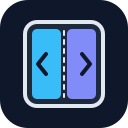

<p align="center">
  
</p>

# iPhone Duo Skills

A Codex plugin with a skill for finding and applying SwiftUI examples for iPhone Duo. It uses [iPhone Duo by Examples](https://github.com/artemnovichkov/iPhone-Duo-by-Examples) as its canonical example source.

## What it does

- Searches the upstream catalog and source files for relevant API examples.
- Covers hinge changes, reserved regions, `ArrangementView`, vertical bar toolbars, and container content margins described by the skill.
- Provides adaptive layout guidance for state ownership, stable view identity, keyboard handling, and tabletop fallback.
- Cites source files and distinguishes documented APIs, simulator observations, and application design choices.

The upstream catalog targets SwiftUI and iOS 27.1. Verify API availability and runtime behavior in your target SDK and device or simulator.

## Install the skill

To install the bundled skill directly into your local Codex skills directory:

```sh
git clone https://github.com/SoundBlaster/iphone-duo-skills.git
mkdir -p "${CODEX_HOME:-$HOME/.codex}/skills"
cp -R iphone-duo-skills/skills/iphone-duo-examples "${CODEX_HOME:-$HOME/.codex}/skills/"
```

If you already have a skill named `iphone-duo-examples`, review it before copying to avoid overwriting local changes.

This repository also includes a [Codex plugin manifest](.codex-plugin/plugin.json) and a [portable plugin manifest](plugin.json).

## Use it

Ask Codex to use the skill, for example:

```text
Use $iphone-duo-examples to find an ArrangementView example and explain its layout.
```

```text
Use $iphone-duo-examples to adapt my SwiftUI screen for tabletop mode
while preserving the input draft and focus during keyboard transitions.
```

The skill can read upstream files directly, discover a checkout in the workspace, or clone the example repository when local inspection is needed. To select an existing checkout explicitly, set this variable in the environment used to launch Codex:

```sh
export IPHONE_DUO_EXAMPLES_REPO="/path/to/iPhone-Duo-by-Examples"
```

The skill reports missing source access or API coverage and only modifies the upstream example repository when explicitly requested.

## Repository contents

| Path | Purpose |
| --- | --- |
| [SKILL.md](skills/iphone-duo-examples/SKILL.md) | Source lookup and adaptation workflow |
| [Adaptive layout lessons](skills/iphone-duo-examples/references/adaptive-layout-lessons.md) | Composition, state, keyboard, and layout policy guidance |
| [OpenAI interface metadata](skills/iphone-duo-examples/agents/openai.yaml) | Skill display metadata |
| [Validation script](scripts/validate_plugin.py) | Manifest consistency and bundled skill structure checks |

## Validate locally

From the repository root:

```sh
python3 -m venv .venv
.venv/bin/python -m pip install -r requirements-ci.txt
.venv/bin/python scripts/validate_plugin.py
git diff --check
```

The [GitHub Actions workflow](.github/workflows/validate-plugin.yml) also validates skill frontmatter and naming.

## License

[MIT](LICENSE). Upstream examples are maintained separately; consult their repository for applicable licensing.
